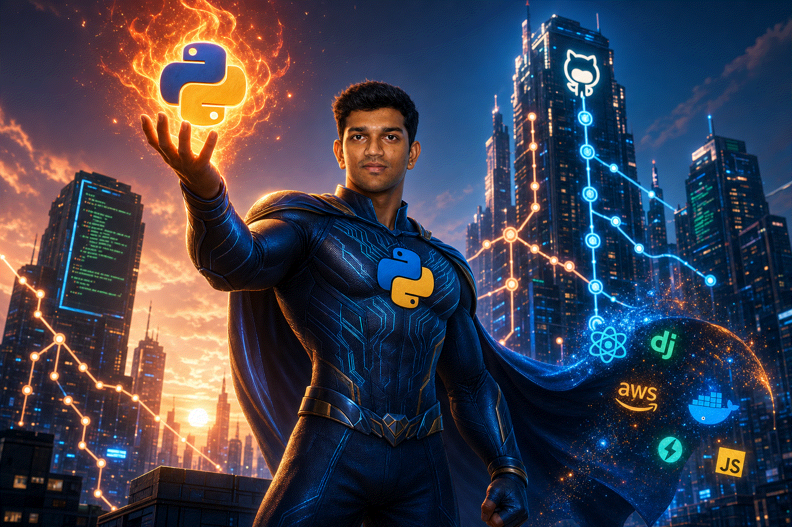

# Kevin.AP

### Aspiring AI Engineer

*Building intelligent systems with LLMs, RAG pipelines, multi-agent architectures, and production-ready AI applications.*

 

 

---

 
<em>Powering the future with Python, LLMs & intelligent agents 🤖⚡</em>

---

## 👋 About Me

I'm **Kevin.AP** — an **Aspiring AI Engineer** transitioning into artificial intelligence and machine learning. I combine a strong foundation in **data engineering** and **analytics** with hands-on experience building **LLM applications**, **RAG systems**, **multi-agent workflows**, and **computer vision** models.

- 🎯 **Career goal:** Land a role as an **AI Engineer** building production LLM and ML systems
- 🔭 **Currently building:** RAG chatbots, LangGraph agents, fine-tuned models, and end-to-end AI pipelines
- 🛠️ **AI stack:** Python · LangChain · LangGraph · OpenAI · HuggingFace · PyTorch · RAG · Vector DBs · Whisper
- 🌱 **Learning:** Agentic AI, model fine-tuning, MLOps, and scalable AI system design
- 💼 **Background:** Data engineering (Azure, Snowflake, Spark) — strong data foundation for AI at scale
- 💬 **Ask me about:** LLMs, RAG, AI agents, prompt engineering, ML model deployment, or breaking into AI
- ⚡ **Fun fact:** I believe the best AI engineers understand data first — pipelines feed models, models drive intelligence

---

## 🛠️ Skills

### AI / Machine Learning

### Generative AI & Agents

### Data & MLOps Foundation

### Tools

 

  

---

## 📊 GitHub Analytics

 

 

---

## 🚀 Featured Projects

### 🤖 AI / Machine Learning

| Project | Description | Stack |
|---------|-------------|-------|
| [RAG Hybrid Chatbot](https://github.com/Kevin20AP/ai-ml-projects/tree/main/rag-hybrid-chatbot) | RAG chatbot with hybrid search (ChromaDB + BM25) and multi-turn conversation memory | LangChain · OpenAI · ChromaDB |
| [LangGraph Support Bot](https://github.com/Kevin20AP/ai-ml-projects/tree/main/langgraph-support-bot) | Multi-agent support bot with intent routing and human escalation | LangGraph · LangChain · OpenAI |
| [Multi-Agent Research System](https://github.com/Kevin20AP/ai-ml-projects/tree/main/multi-agent-research-system) | Researcher, Writer, and Critic agents with automatic revision loop | LangGraph · LangChain · OpenAI |
| [ReAct Agent](https://github.com/Kevin20AP/ai-ml-projects/tree/main/react-agent) | Tool-using agent with calculator, weather, and Wikipedia via ReAct loop | LangGraph · LangChain · OpenAI |
| [HuggingFace Fine-Tuning](https://github.com/Kevin20AP/ai-ml-projects/tree/main/huggingface-fine-tuning) | Fine-tune GPT-2 on AI Q&A data with before/after comparison | HuggingFace · PyTorch · GPT-2 |
| [Voice AI Assistant](https://github.com/Kevin20AP/ai-ml-projects/tree/main/voice-assistant) | Hands-free assistant with Whisper STT and gTTS speech output | Whisper · OpenAI · gTTS |
| [Sensitive Data Detection](https://github.com/Kevin20AP/ai-ml-projects/tree/main/sensitive-data-detection) | CNN + OCR system to detect sensitive data exposure in images | TensorFlow · Flask · Tesseract |
| [Fake Job Prediction](https://github.com/Kevin20AP/ai-ml-projects/tree/main/fake-job-prediction) | NLP model to classify job postings as real or fake | Scikit-learn · Jupyter |

> 📁 All AI/ML projects: **[ai-ml-projects](https://github.com/Kevin20AP/ai-ml-projects)**

### 📊 Data Engineering *(AI Foundation)*

| Project | Description | Stack |
|---------|-------------|-------|
| [Spotify Azure Pipeline](https://github.com/Kevin20AP/data-engineering-projects/tree/main/spotify-azure-databricks) | End-to-end analytics pipeline on Azure Databricks with PySpark | Azure · Databricks · PySpark |
| [Airbnb Analytics Platform](https://github.com/Kevin20AP/data-engineering-projects/tree/main/airbnb-snowflake-dbt) | DBT + Snowflake analytics with AWS ingestion | DBT · Snowflake · AWS |
| [Netflix Data Analysis](https://github.com/Kevin20AP/data-engineering-projects/tree/main/netflix-dbt-snowflake) | Dimensional modeling and data quality for content analytics | DBT · Snowflake · SQL |
| [IPL Cricket Analytics](https://github.com/Kevin20AP/data-engineering-projects/tree/main/ipl-apache-spark) | Large-scale match and player analytics with Apache Spark | Spark · Python · Azure |

> 📁 All data engineering projects: **[data-engineering-projects](https://github.com/Kevin20AP/data-engineering-projects)**

---

## 🤝 Connect With Me

---

  

**Open to AI Engineer opportunities — let's build the future together.** 🤖

